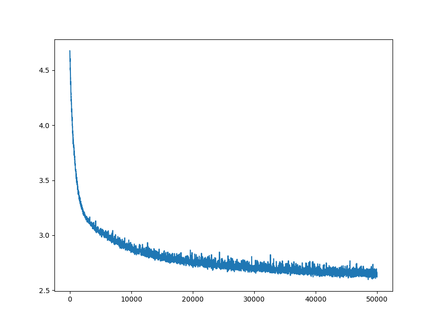

This repo contains a collection of sequential prediction model implementations in a few different languages/libraries,
mostly sandbox stuff. The interfaces may be cleaned up in the future, but these projects are just a research/testing sandbox.
Also see DoubleSecretProbation repo for Word2Vec and other nlp implementation tidbits.

If you're in need of an implementation for research or other purposes, please contact me.

Models and implementations
1) Vanilla rnn in numpy
2) Vanilla rnn in torch, manually constructed (not builtin torch.nn.RNN module)
3) Torch gru implementation for one-hot encoded symbol sequences

./resources: junk folder for images, etc.
./models: saved parameters
./ : duh code
./data: training data

Training data is Treasure Island, by Robert Louis Stevenson.



Gru character generation after modest training below. This model was training purely on character-by-character transitions
but shows performance beyond mere bigram training due to the gru's hidden state. Regenerate locally with
	*python3 BPTT.py -batchSize=4 -maxEpochs=6000 -momentum=0.9 -eta=1E-3*
which is just a basic set of non-optimized params and validation-less training.
```
	Generating 10 sequences with stochastic=True
	^ztf^^e^^lzyt^q^zvfff^qvcjzxqmz<
	ydpzms^xsfbtjjjtjbpswdvpambawjq<
	ioovff^n^u^rt^wxamvbvzb^w^lpvwf<
	^npsbsu^zasaotaza^fjqvftamawpzz<
	ts^^lnwfawnuhaoszzpmzhpmzzzaovp<
	mfp^h^luhf^uoom^hp^zazppztpmfps<
	jjjectpfmauswjznvfieovbvatodmva<
	id bfmfuh$hpzmeoumjnptjjcpnpffz<
	wet^gv^t^y^xjljjbowfmvtit^hjxuw<
	kbqeouomoooooemgujeodoqvxzpz^da<

	Generating 10 sequences with stochastic=False
	zor wastherryound wasther$$$dly<
	ver and thering ther$$d$$d$$$d$<
	oun waskering$$drorky$$$$$d$$$$<
	noverry wasker$$d$$d$$$d$$$$d$$<
	ran her wastherr$$d$$d$$$$$$$$$<
	wand wastherryound$urker$$$d$$$<
	kand wastherring ther$$$d$$$$d$<
	ran her wastherr$$d$$d$$$$$$$$$<
	ghe wastherryound$urrery$$$d$$$<
	so waskering$doullyour$$$d$$$$$<

```
