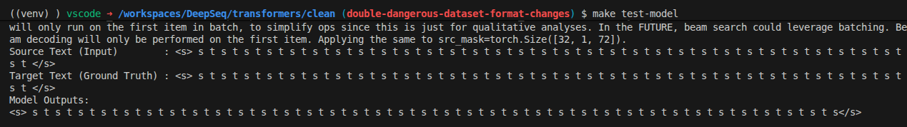
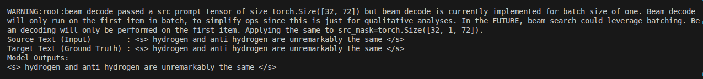

# Transformer

This project was derived from the [Annotated Transformer jupyter
notebook](https://nlp.seas.harvard.edu/annotated-transformer/) and [github
repo](https://github.com/harvardnlp/annotated-transformer). The original code
was not for production use, and I extended and fixed the code for my own
training in transformer models. Transformers advanced NLP methods just as I was
leaving graduate school, and this was my opportunity to learn, relying heavily
on the implementation of the original authors.

This repo is primarily for research or demonstration purposes, to learn and
introspect transformer models and their many modifications. I added a beam
search example and certain other advancements to the original model. Please fork
and extend this code as needed. Many other production-grade transformer models
are now in circulation, and I suggest that they be used for production/work
projects.

Most usage of this version is currently for in-language seq2seq models: encode
src vectors for language A to output targets also in language A. I did this for
simplicity, only intending to develop single language tasks; however this is
useful for summarization and multi-modal models. For example, the `make train`
recipe trains a model using input english-text facebook headlines on those same
headlines as the target outputs; this is a degenerate usage of the translation
usage of a seq2seq transformer, but was done for development. In the future I
plan to break out this model into translation, in-language, and multi-modal
seq2seq models.

## Usage

### Testing

0) `make unit-tests`: run unit tests, tests that run fast in a standalone
   manner.
0) Train and verify the test model. This model trains on a small set of
  repeating two-symbol sequences like "a b a b a b..." to verify model
  correctness and for development/debugging. This test is the most useful for
  development and experimentation, to confirm model correctness by training on a
  trivial problem, but a problem that encompasses autoregressive properties
  (repeating non-equal symbols) and vicabulary properties. The model is trained
  using identical src and target input, which is single-language training.
    * `make train-test-model`: trains the test model. This should only take a a
      few minutes on a cpu, training a model on a set of small repeating
      sequences. In more detail, this intentionally overfits on a small dataset
      for which "a b a b a..." is src and also the target. This is extremely
      useful for testing/development that requires a trained model, since the
      data is autoregressive but also very small for short training times. The
      training examples are intentionally constructed such that the vocabulary
      of each sequence is independent of other sequences, to confirm the model
      can learn independent symbols (a trivial case). This could be extended to
      make sequence vocabularies overlap, or to have different autoregressive
      properties, to confirm the model learns these. This is useful to check if
      I've broken anything :) .
    * `make test-model`: runs inference on the test model, using beam search.
      The trained model should overfit and exactly output the input sequences,
      proving that the model is working (albeit, overfitting on such a small
      training set). 

1) `make train`: Train a seq2seq encoder-decoder transformer model on the data
  and model parameters pointed to by the config. Configure a config model to
  point at your target dataset and this will train the config's model.
2) `BEAM_LENGTH=4 make check-outputs`: given a trained model and a config
  pointing to it, this loads it and runs inference by running beam-search,
  predicting sequence outputs using the training data to create output.
  Qualitatively, this is to gauge how closely the model outputs correctly for
  the same training input. 


## Known Issues

* this repo is locked to an older version of torch due to the original
  dependence on torchtext. To update it, I need to eliminate torchtext usage and
  then update torch version.

# Personal TODO

TODO: I'm explicitly targeting presentation-ness, whose requirements are:
* api/deployability
* encoder-only and decoder-only architectures
* interactive support: much of this could be supported through stdin cleverness.
    * encode user context: take words from the user and encode all of them any
      of several ways. Possibly, to get around the relational structure learnt
      by the encoder, encode each word as its own sequence of that word repeated
      until </s>. Average the encoded output of these sequences as the subjet
      matter based "context".
    * encoder target input: this is the autoregressive portion, the user inputs
      one token at a time and is presented a list of continuations, or inputs
      the next token of their own.
    * all tokens from the user must exist in the model.
    * the goal is to show context, and autoregressive success.


TODO: top-levels I would like to support:

0) Make a data-processing module and put all of the text processing in it
1) `-in` and `-out` command line parameters to point to preprocessed line-based
   files for translation from in -> out
2) DONE: if `-in` only, then use `-in` for both input and output
3) Partially complete: add an encoder-only and decoder-only architecture to be
   used only with `-in`: `-in input.txt --encoder-only` and `--decoder-only`
4) tests for each of these; small trained models will suffice
5) resumable training (this is much further ahead)
6) if needed, for translation it might be nice to devise a small language
  dictionary whose tokens map 1:1 to another set of symbols, i.e. "aaa" ->
  "bbb", "ccc" -> "ddd". Additional semantic structure for pseudo "POS"
  mechanics could be added using a markov model or simple parse tree, depending
  on the test goal: (1) prove transformer learns simple dictionary (2) get it to
  learn more semantic structure (3) by whatever means show how these structures
  are learned. Note that dictionary learning of this kind if essentially
  identical to training a transformer on its own input as output for some small
  language set, even a few simple phrases perhaps.
7) information-retrieval based training metrics: consider including
   task-oriented metrics of enoding by checking how highly the network ranks a
   target phrase as a vector: encode input into context; compare the encoding's
   vector with every other encoded input in the training/validation dataset;
   plot the increase in ranking as training occurs. Recall this was used with
   words for word2vec training.

```bash
# Symmetrical language learning
python training_driver.py -c $(CONFIG_PATH) -in ./data/german_lines.txt -out ./data/english_lines.txt
# Reflexive language learning: provide only '-in'
python training_driver.py -c $(CONFIG_PATH) -in ./data/english_lines.txt
# Encoder-only in-language training
python training_driver.py -c $(CONFIG_PATH) -in ./data/english_lines.txt --enc-only
```

## Secure LLMs

Problem: a developer wishes to utilize an LLM on a sensitive project. The LLM
company and its server is untrusted and should not have access to the details of
the project. The task is, is there a way for the LLM to ingest the project
without ever being able to reconstruct it?

In cryptographic detail, the LLM M requires access to sensitive tokens W to
perform inference, but should never be able to read them directly nor
reconstruct them. The tokens are translated to vectors via Vocab map V: w -> v,
and the layers of The LLM internally encode their semantic relationships. In
essence, the LLM only knows a bunch of vectors, although these do allow
reconstruction.

Homomorphic encryption: an analyst wishes to perform an arithmetic operation an
an encrypted datastore, such as summing the number of disease instances of a
sensitive and protected population whose privacy and identity must be preserved.

Where E(m) represents the encryption function E on message m; such that anything
output of E() is strongly encrypted and not visible:

* homomorphic addition:       E(a+b) = E(a) + E(b)
* homomorphic multiplication: E(a*b) = E(a) * E(b)

What does this mean? A user can utilize these properties as follows. A user has
secrets a and b, they encrypt these and upload them to an untrusted server to
perform some computation (i.e. E(a+b) = E(a) + E(b)), and the user decrypt the
end result with their private key.

The property here provides mostly for computation, such that a user encrypts
some values to be operated upon, and these are then submitted encrypted to some
endpoint to run the computation.

* the untrusted server performs the computations but never sees the results or
  content of these computations
* taylor series' can be used to formulate complex funcs like e^f(x) to simple
  mult and summation operations.
* homomorhic encryption deals only with integers; tricks are used to convert
  real decimal values to integers, such as multiplying them by 10000 to provide
  4 digits of decimal precision.
* homomorphic encryption performance worsens as more computations are performed
  and "noise" accumulates, because reasons.
* training a neural network homomorphically (the network is encoded and sent up
  for training as an encrypted asset) went from 0.05s to 50s.
* training a neural network provides a grossly brute force example, whereby all
  weights are encoded, and then some hardware/infrastructure performs all of the
  training computations without ever seeing the weights or their corresponding
  inputs. The final trained weights are then returned to the user.


In order perform inference in a secure manner, a user submits their complete
llm's weights to an endpoint, each of whose operations are known/defined
unencrypted, but the atomic operations (mult, sum) are executed on the
architecture. The results of computation are returned to the user. The weights
in this scenario are the private element; the architecture of the llm is public.

* the user can train their llm's wieghts in their own space, efficiently
* inference can be implemented homomorphically, though I doubt this would ever
  be efficient.

To make this more efficient, allow the real-valued vectors to be computed
publicly, since these are just real numbers. Instead, use homomorphic encryption
only for the inference side, using beam search as an example. The boundary is
around the computation; the user encrypts all of the query tokens' vector
values, then submits these up to some endpoint that implements only beam search
computations, from which the result vectors are returned.

Otherwise, even though LLM's deal in pseudo-encrypted real valued vectors,
ultimately they are decodeable in the clear. The motivating example is that of a
user needing to run inference on a prompt and context (i.e. code) that should
not be revealed; this would be some sensitive code submitted to a code-based
LLM. Encoding the prompt or context into some pseudo-opaque vector is still
equivalent to revealing the context and the prompt. Though you could potentially
implement a degree of obfuscation by separating LLM layers such that (virtually
speaking) a sensitive layer would only ask generic questions of the larger,
frontier layers. Information in LLMs propagates via multiplication and addition,
accordingly there is no fuzzy boundary that can be imposed between the sensitive
information content and the higher-level understanding of the LLM.

One false premise is the idea of somehow training an LLM to have some context
layer of pseudo-opaque real values as a broker between the generic understanding
of the LLM and the encoding of the information to be hidden. There is no hard
cryptoraphic boundary between the hidden information and the rest of the LLM.
The only crytographically secure way to protect the data is to fully encrypt the
arithmetic operations, and therefore, to homomorphically encrypt the entire
inference process. As a trivial example, a simple neural network whose inputs
need to be evaluated without leakage requires running each of its arithmetic
operations in a homomorphically encrypted space.

